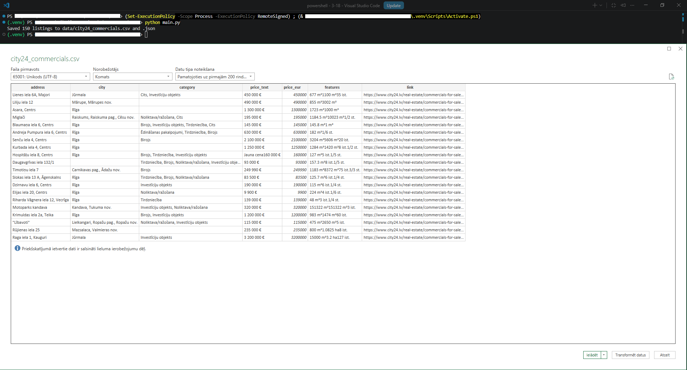
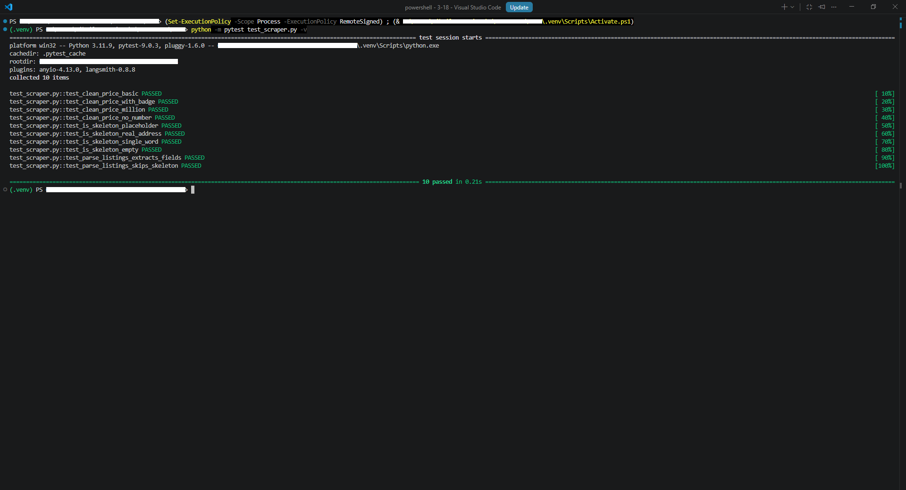

# Commercial Real Estate Scraper + AI Analysis

## Overview

A Python pipeline that scrapes commercial real-estate listings from
[city24.lv](https://www.city24.lv) with Selenium across multiple result pages,
saves them in a structured form with Pandas (CSV + JSON), and analyzes the same
data **three independent ways**, each with a different AI framework:

- **LangChain** — a plain-language "Top 5 offers" business summary.
- **LlamaIndex** — natural-language questions about the data (text-to-SQL).
- **CrewAI** — two collaborating agents: a Scraper Agent and an Analyst Agent.

The scraper is built for reliability on a JavaScript-rendered, bot-protected
site: it uses `WebDriverWait`, handles errors, paginates politely, and does not
rely on `time.sleep` for loading. The scraping logic lives in a single module
(`scraper.py`) reused by both `main.py` and the CrewAI agent, and its parsing
and price-cleaning functions are covered by unit tests.



## Technologies Used

- **Python 3.11** — core language
- **Selenium** — browser automation (also gets past the site's bot protection)
- **BeautifulSoup4** — extracts data from a static HTML snapshot
- **Pandas** — structuring, cleaning, and saving the data
- **pytest** — unit tests for the parsing and price-cleaning logic
- **LangChain** (`langchain-openai`) — analysis A (summary)
- **LlamaIndex** (core `NLSQLTableQueryEngine` + SQLAlchemy) — analysis B (Q&A)
- **CrewAI** — analysis C (multi-agent)
- **OpenRouter** — LLM backend for all three analyses
- **python-dotenv** — API key management
- **VS Code** — development environment

## Setup

### Requirements

- Python 3.11
- Google Chrome installed (Selenium 4 downloads the matching driver automatically)
- An OpenRouter API key (only needed for the three AI analyses)

### Create the environment and install dependencies

```powershell
py -3.11 -m venv .venv
.venv\Scripts\activate
pip install -r requirements.txt
```

### Add your API key

Create a `.env` file in the project root:

```
OPENROUTER_API_KEY=your-openrouter-api-key-here
```

The `.env` file is in `.gitignore`, so the key never reaches the repository.
The scraper itself works without a key — only the AI analyses need it.

## How to Run

```powershell
python main.py                 # scrape city24.lv (multiple pages) -> CSV + JSON
python analysis_langchain.py   # analysis A: LangChain "Top 5" summary
python analysis_llamaindex.py  # analysis B: LlamaIndex natural-language Q&A
python analysis_crewai.py      # analysis C: CrewAI two-agent crew
python list_models.py          # helper: list available OpenRouter models
python -m pytest -v            # run the unit tests
```

`main.py` produces the data; the three analysis scripts read the saved CSV
(analysis C re-scrapes live through its Scraper Agent).


## Project Structure

```
City24-Scraper/
├── scraper.py              # all scraping logic (single source of truth)
├── main.py                 # runs the scraper -> CSV + JSON
├── test_scraper.py         # unit tests for parsing + price cleaning
├── analysis_langchain.py   # Analysis A: LangChain summary
├── analysis_llamaindex.py  # Analysis B: LlamaIndex text-to-SQL Q&A
├── analysis_crewai.py      # Analysis C: CrewAI scraper + analyst agents
├── list_models.py          # helper: list OpenRouter models
├── data/                   # output CSV + JSON (the scraped dataset)
├── screenshots/            # screenshots used in this README
├── requirements.txt
├── .gitignore
├── .env                    # OpenRouter key (ignored by Git)
└── README.md
```

## How the Scraper Works

city24.lv is a JavaScript-rendered (React) site behind bot protection, so a
plain HTTP request is not enough. The scraper:

1. Opens each results page with a real (non-headless) Chrome via Selenium,
   which gets past the bot protection and runs the page's JavaScript.
2. Waits with `WebDriverWait` until **real listing content** has loaded — not
   just the skeleton placeholders the page shows first.
3. Takes a **single static HTML snapshot** and parses it with BeautifulSoup.
   Working on a static snapshot avoids `StaleElementReferenceException`, which
   happens when React re-renders the list while live element references are held.
4. **Paginates** through the result pages (path segment `/pg=N`), with a short
   courtesy delay between pages and a page cap, to stay responsible toward the
   server (~150 listings).
5. Extracts each listing's address, city, category, price (raw + cleaned
   numeric), size/features, and link, and saves everything with Pandas as CSV
   and JSON.

### Data fields

| Column | Description |
|---|---|
| `address` | Street address / object name |
| `city` | City or municipality |
| `category` | Property type (e.g. retail, office, warehouse) |
| `price_text` | Price as shown on the site |
| `price_eur` | Price cleaned to a number (EUR) |
| `features` | Area / rooms info |
| `link` | Full URL to the listing |

## Testing

The pure logic — HTML parsing (`parse_listings`), price cleaning
(`clean_price`), and skeleton detection (`is_skeleton`) — is covered by unit
tests in `test_scraper.py`, run with `pytest`. The parsing test runs on a small
HTML sample, so the whole suite needs no browser or network and runs instantly.



## The Three Analyses

### A — LangChain "Top 5 offers"

Python computes all the statistics (count, average, min/max, the 5 cheapest),
and the LLM is asked **only to phrase those finished numbers** in Latvian. The
model never does the arithmetic, so the figures in the summary are always exact.

### B — LlamaIndex natural-language Q&A (text-to-SQL)

The data is loaded into an in-memory SQLite table. LlamaIndex's
`NLSQLTableQueryEngine` turns a Latvian question into a SQL query (e.g. "which
is cheapest?" -> `... ORDER BY price_eur LIMIT 1`), runs it, and phrases the
answer.

### C — CrewAI two collaborating agents

- **Scraper Agent** — has a Selenium-based tool that scrapes the listings.
- **Analyst Agent** — receives the scraped data and writes a Latvian summary
  with the Top 5 cheapest offers.

The two agents run sequentially as a Crew, passing the scraped data from the
first task to the second.

## Key Design Decisions

### 1. Selenium renders, BeautifulSoup parses a static snapshot

Selenium gets past bot protection, runs the JavaScript, waits, and (in the
agent) drives the browser. BeautifulSoup then parses a frozen snapshot of the
result. This split removes the `StaleElementReferenceException` that live
element references cause on a re-rendering React page.

### 2. Wait for real content, not skeleton placeholders

The page first shows skeleton placeholders (an address renders as `mmmmm`).
Waiting only for an element to *exist* is not enough, because the skeleton
exists too. The scraper waits until real addresses are present and skips any
remaining skeleton rows during extraction.

### 3. robots.txt compliance

The scraper only reads plain category and page URLs and avoids every path
parameter disallowed in `robots.txt` (price/floor/category/sort filters, account
pages, etc.). It scrapes a capped, modest volume.

### 4. The AI rephrases, it does not calculate (analysis A)

All numbers come from Python; the model only turns them into sentences, which
guarantees the figures are correct.

### 5. A maintained tool over a deprecated one (analysis B)

LlamaIndex's `PandasQueryEngine` lives in the deprecated
`llama-index-experimental` package with a fragile dependency chain. The project
uses the maintained core `NLSQLTableQueryEngine` (text-to-SQL) instead.

### 6. One scraping module, with tested pure functions

The scraping logic lives only in `scraper.py` (used by `main.py` and the CrewAI
agent), and its parsing and price-cleaning functions are covered by unit tests —
so a change in one place is reflected everywhere and verified automatically.

### 7. The API key is never in the source code

The OpenRouter key is read from `.env` via `python-dotenv`, and `.env` is in
`.gitignore` from the start.

## Challenges & Solutions

| Problem | Solution |
|---|---|
| Listings loaded as skeleton placeholders (`mmmmm`) and were scraped empty | Wait until real addresses are present, and skip skeleton rows during parsing |
| `StaleElementReferenceException` when React re-rendered the list | Parse a single static `page_source` snapshot with BeautifulSoup instead of holding live element references |
| Price stored as text with `€`, spaces, and a "Jauna cena" badge | Cleaned to a numeric `price_eur` column with a regex (kept the raw text too) |
| Python 3.14 had no prebuilt wheels; `pip` tried to compile pandas and failed | Recreated the virtual environment with Python 3.11 |
| `llama-index-experimental` is deprecated and its import chain failed | Switched to the maintained core `NLSQLTableQueryEngine` |
| OpenRouter free models returned `429` (rate-limited) | Switched to a cheap, reliable paid model (`openai/gpt-oss-120b`) |
| LlamaIndex tried to load default OpenAI embeddings | Set a `MockEmbedding`; explicit-table text-to-SQL does not need real embeddings |

## Scope and Limitations

The project is honest about its current edges:

- **One listing category.** It scrapes `commercials-for-sale`; the page count is
  capped (~150 listings across a few pages) to stay responsible — easily raised.
- **`category` can be empty** for some listings — handled gracefully.
- **Text-to-SQL (B) is not 100% reliable.** The same question can succeed or fail
  depending on the SQL the model generates; a clearer question makes it more
  reliable.
- **The CrewAI run re-scrapes live** every time, so it is slower than the other
  two scripts.
- **Free/cheap LLM models** can be rate-limited or vary slightly between runs.
